# Confess-Karo

Confess-Karo Social Media App is a hybrid mobile application which is used to connect people and help each other in problems. The app helps users to be anonymous which keeps the identity of user secured. The app lets users to confess their feelings and expressions to others on which other users can give suggestions if they too have faced related to have an opinion to express. The app makes users to play a role such as a friend, brother/sister, and many other roles making users comfortable while expressing their regards. 

The app is designed in a colorful theme which gives user an eye pleasing user experience. App also is designed using secured authentication of Google’s Firebase Authentication so that no user data is lost or compromised. App also has email verification App also has email verification without which user cannot proceed letting fake users away. 

Confess-Karo Social Media app also has features to express stories. Users can anonymously express their part of stories. Others can view, like, and comment on both confessions and stories expressing their opinions on related post. Each post is determined with its popularity calculated on the basis of its views, likes, and comments. The app also has features of filtering posts on the basis of tags so that people can view only those posts which are tagged with particular tag attached to it while posting by the writer. The app is fast and is supported by custom fast paging and loading which helps keep app stable and fast even in heavy traffic. 

The app is fully optimized with fast algorithms at each phase of developing. The app is made light weight and as stable as possible. Expo is used to run app in browser and phone. To make run app in Android as well IOS with the same code, app is developed in React Native which is a framework of JavaScript.
The app also has feature of reporting any post. If a post is been reported several times then it leads to post ban or user ban by admin. Also app has feature of editing post as user can see his/her post on filtering only user’s post panel. App also has a feature of notification in which user is been notified of by any new like or comment on his/her post. Notifications which are new and not read are filtered to the top and highlighted and on clicking lead the notifications to be read and redirects user to the post. 

Here are some Details of the app.

The Signup 1 screen is when user wants to create an account for the app. It consists of various parts with header including the name of social media app with a back button which leads user back to first page. The screen consists of two inputs fields namely email and password without which user cannot proceed. If fields are empty user gets an error text. Also user cannot enter invalid email or password as email and password are validated without which user cannot proceed. 

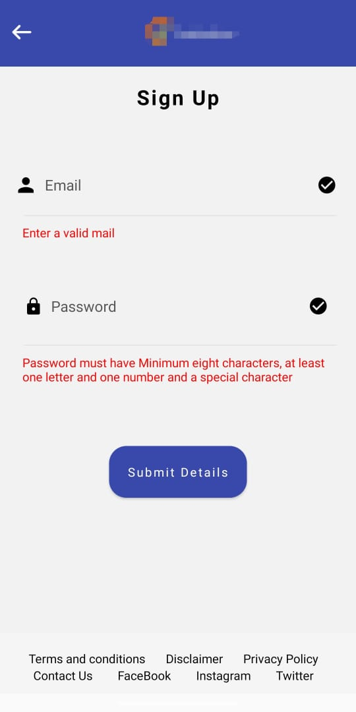&nbsp;&nbsp;&nbsp;&nbsp;&nbsp;&nbsp;&nbsp;&nbsp;&nbsp;&nbsp;&nbsp;&nbsp;&nbsp;&nbsp;&nbsp;&nbsp;&nbsp;
   &nbsp;&nbsp;&nbsp;&nbsp;&nbsp;&nbsp;&nbsp;&nbsp;&nbsp;&nbsp;&nbsp;&nbsp;&nbsp;&nbsp;&nbsp;&nbsp;&nbsp;&nbsp;&nbsp;&nbsp;&nbsp;&nbsp;&nbsp;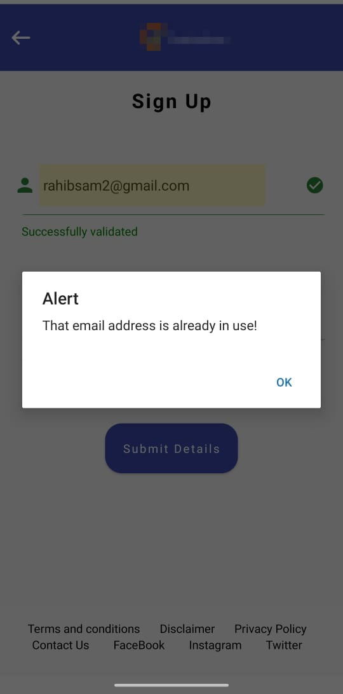
   
   1.SignUp Page&nbsp;&nbsp;&nbsp;&nbsp;&nbsp;&nbsp;&nbsp;&nbsp;&nbsp;&nbsp;&nbsp;&nbsp;&nbsp;&nbsp;&nbsp;&nbsp;&nbsp;&nbsp;
   &nbsp;&nbsp;&nbsp;&nbsp;&nbsp;&nbsp;&nbsp;&nbsp;&nbsp;&nbsp;&nbsp;&nbsp;&nbsp;&nbsp;&nbsp;&nbsp;&nbsp;&nbsp;&nbsp;&nbsp;&nbsp;&nbsp;&nbsp;&nbsp;&nbsp;&nbsp;&nbsp;&nbsp;&nbsp;&nbsp;&nbsp;&nbsp;&nbsp;&nbsp;&nbsp;&nbsp;&nbsp;&nbsp;&nbsp;&nbsp;&nbsp;&nbsp;&nbsp;&nbsp;&nbsp;&nbsp;&nbsp;&nbsp;&nbsp;&nbsp;&nbsp;&nbsp;2.Signup Page
   
   
   Email verification screen is redirected after signup 1 screen which confirms if the email is correct or not. A verification mail is sent to the user’s email which is to be verified by the user without which user can proceed. If the email is not verified, it gives an error stating email not verified. The screen consists of some lines asking user to verify email with two buttons namely proceed and goBack buttons. After proceed a check is run checking if user’s account is verified or not. If the user’s account is verified, user is redirected to Signup 2 screen else an error message is highlighted. There is a go back button which redirects user back to signup 1 page.
   
   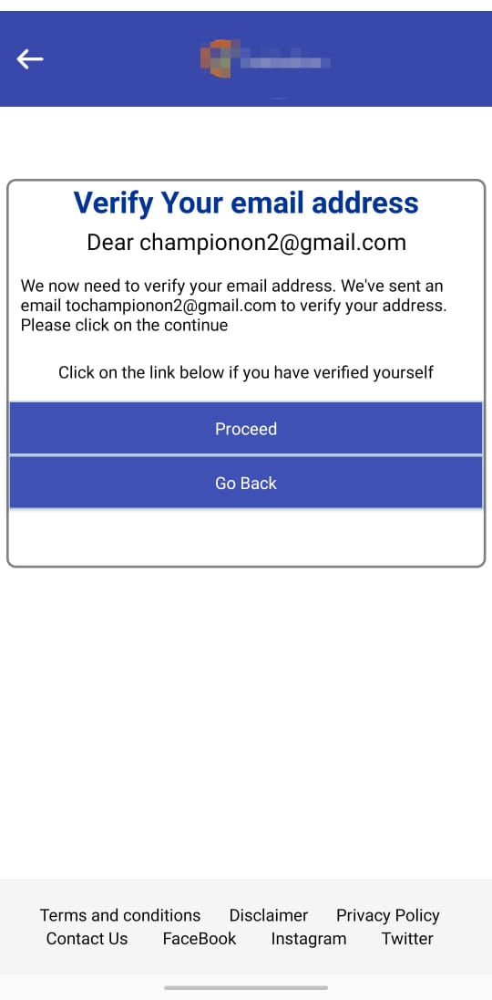&nbsp;&nbsp;&nbsp;&nbsp;&nbsp;&nbsp;&nbsp;&nbsp;&nbsp;&nbsp;&nbsp;&nbsp;&nbsp;&nbsp;&nbsp;&nbsp;&nbsp;
   &nbsp;&nbsp;&nbsp;&nbsp;&nbsp;&nbsp;&nbsp;&nbsp;&nbsp;&nbsp;&nbsp;&nbsp;&nbsp;&nbsp;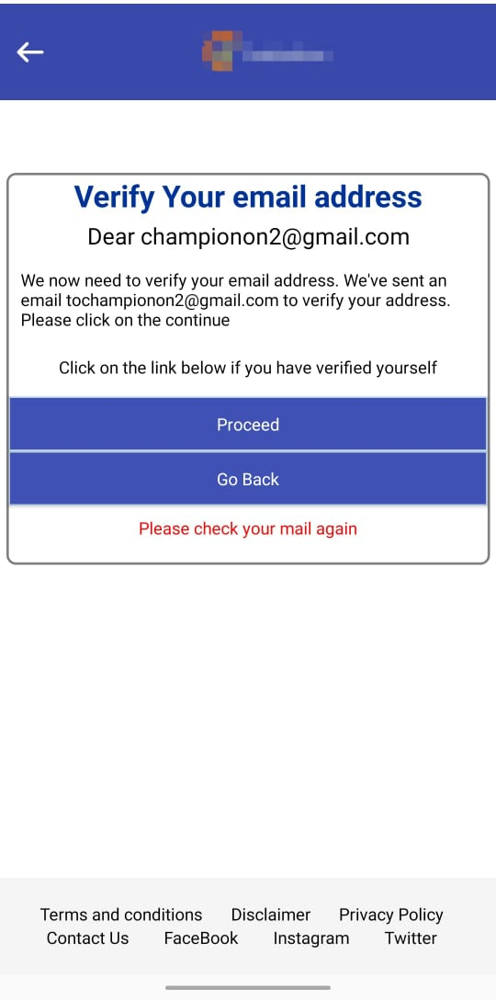
   
 3.Email-Verification Page&nbsp;&nbsp;&nbsp;&nbsp;&nbsp;&nbsp;&nbsp;&nbsp;&nbsp;&nbsp;&nbsp;&nbsp;&nbsp;&nbsp;&nbsp;&nbsp;&nbsp;&nbsp;&nbsp;&nbsp;&nbsp;&nbsp;&nbsp;&nbsp;&nbsp;&nbsp;&nbsp;&nbsp;&nbsp;&nbsp;&nbsp;&nbsp;&nbsp;&nbsp;&nbsp;&nbsp;&nbsp;&nbsp;
   &nbsp;&nbsp;&nbsp;&nbsp;&nbsp;&nbsp;4.Email-Verification Page 
   
   Signup 2 is the second step which is required by a user to sign up completely. Even if user logs in with a verified account but has not completed signup 2, will be redirected to signup 2. Signup 2 consists of 2 inputs field asking for user’s name and date of birth. Name and date of birth are validated so that user is acknowledged if there is any error. Also there is a set of radio button asking user about his/her gender. The app lets user to select roles to choose which he/she plays in their life. Roles are compulsory and user should choose at least one to proceed. Roles are displayed according to the gender the user chooses. For example if user chooses male as his gender, the roles will be father, brother, friend, son, etc. if user chooses female, then roles, will be mother, sister, daughter, etc. There is variety of roles and user has to check the checkboxes present below each image of the role. After selecting the role user should click submit details and proceed further using the app. After submitting, user’s details are saved securely in the data base. These roles are used to confess or comment their opinions.
   
   Login screen is redirected when we click login button at the index page. Login page consists of two inputs fields namely email and password fields. Wrong email results in error text. Also password and email fields should not be empty. Login only works for already authenticated and verified users. So if user clicks login button with wrong password and email, error message is being displayed. If user’s email and password are correct, but signup 2 is not completed then user is redirected to signup2 page and if signup 2 is completed then user is directed to the home page of the app. There is an option if user don’t have an account so that he/she can create one by clicking on it.
   
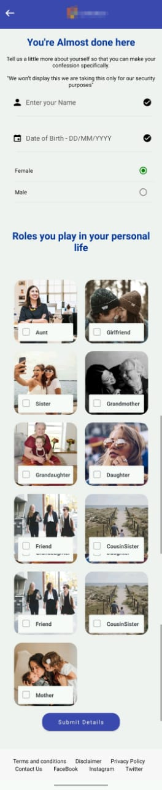&nbsp;&nbsp;&nbsp;&nbsp;&nbsp;&nbsp;&nbsp;&nbsp;&nbsp;&nbsp;&nbsp;&nbsp;&nbsp;&nbsp;&nbsp;&nbsp;&nbsp;
   &nbsp;&nbsp;&nbsp;&nbsp;&nbsp;&nbsp;&nbsp;&nbsp;&nbsp;&nbsp;&nbsp;&nbsp;&nbsp;&nbsp;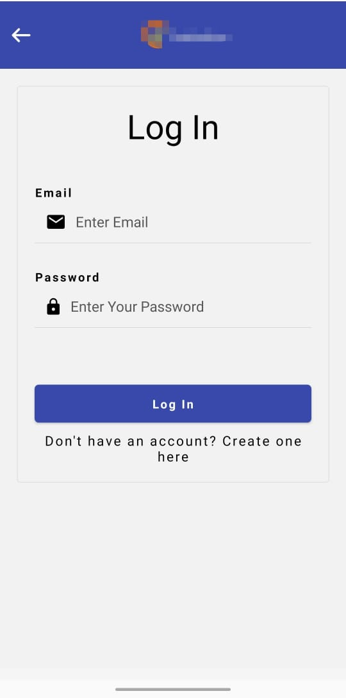
   
5.Signup-2 Page&nbsp;&nbsp;&nbsp;&nbsp;&nbsp;&nbsp;&nbsp;&nbsp;&nbsp;&nbsp;&nbsp;&nbsp;&nbsp;&nbsp;&nbsp;&nbsp;&nbsp;&nbsp;&nbsp;&nbsp;&nbsp;&nbsp;&nbsp;&nbsp;&nbsp;&nbsp;&nbsp;&nbsp;&nbsp;&nbsp;&nbsp;&nbsp;&nbsp;&nbsp;
   &nbsp;&nbsp;&nbsp;&nbsp;&nbsp;&nbsp;&nbsp;&nbsp;&nbsp;&nbsp;&nbsp;&nbsp;&nbsp;&nbsp;&nbsp;&nbsp;&nbsp;&nbsp;&nbsp;&nbsp;&nbsp;&nbsp;&nbsp;&nbsp;&nbsp;&nbsp;&nbsp;&nbsp;&nbsp;&nbsp;&nbsp;&nbsp;&nbsp; 6.Login Page
   
   The home screen is the main screen which user interact with after successfully logging into the website the screen consist of various parts with header including name of the social media app followed by the navigation button and below the header there are two buttons for writing a confession and writing story after that three buttons where user can see his/her confessions, watch confessions on the basis of the tags, and finally his/her written stories as shown in the figure.
   
   On the top right of the header there is a navigation tool from where user can navigate to following pages: Home, Inspirational Story, Notifications, Contact Us and Log Out
This Navigation bar can be accessed through out the application except some pages making it easier for user to interact with and moving from one place to another easily as shown in the figure.

   
   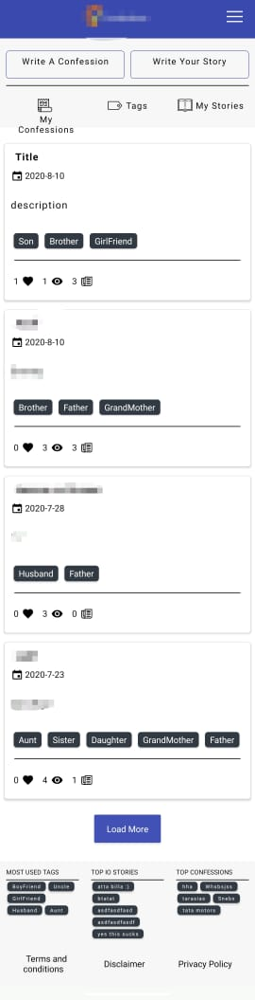&nbsp;&nbsp;&nbsp;&nbsp;&nbsp;&nbsp;&nbsp;&nbsp;&nbsp;&nbsp;&nbsp;&nbsp;&nbsp;&nbsp;&nbsp;&nbsp;&nbsp;
   &nbsp;&nbsp;&nbsp;&nbsp;&nbsp;&nbsp;&nbsp;&nbsp;&nbsp;&nbsp;&nbsp;&nbsp;&nbsp;&nbsp;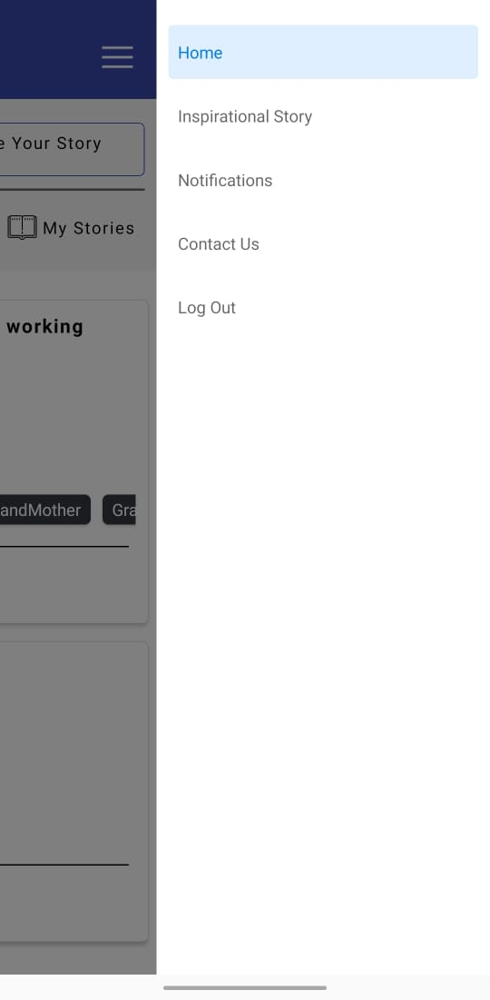
   
   7.Home Page&nbsp;&nbsp;&nbsp;&nbsp;&nbsp;&nbsp;&nbsp;&nbsp;&nbsp;&nbsp;&nbsp;&nbsp;&nbsp;&nbsp;&nbsp;&nbsp;&nbsp;&nbsp;
   &nbsp;&nbsp;&nbsp;&nbsp;&nbsp;&nbsp;&nbsp;&nbsp;&nbsp;&nbsp;&nbsp;&nbsp;&nbsp;&nbsp;&nbsp;&nbsp;&nbsp;&nbsp;&nbsp;&nbsp;&nbsp;&nbsp;&nbsp;&nbsp;&nbsp;&nbsp;&nbsp;&nbsp;&nbsp;&nbsp;&nbsp;&nbsp;&nbsp;&nbsp;&nbsp;&nbsp;&nbsp;&nbsp;&nbsp;&nbsp;&nbsp;&nbsp;&nbsp;&nbsp;&nbsp;8.Navigation Bar 
   
   
   At the bottom of the page there is a footer the first footer part is for the confessions which includes a load more button while scrolling down user can click on that to load more confessions posted by people around the world with the increasing community there is no end to that. The load more option is followed by a block which includes Most Used Top 5 Tags on the basis of confessions, Top 5 Inspirational Stories and Confessions on the basis of likes, comments and views by other users. 
   
   On the Home Page of the website after logging in two buttons namely Write A Confession and Write A Story are there after accessing those user can wrote his/her confession and as well as his/her inspirational story.
   
   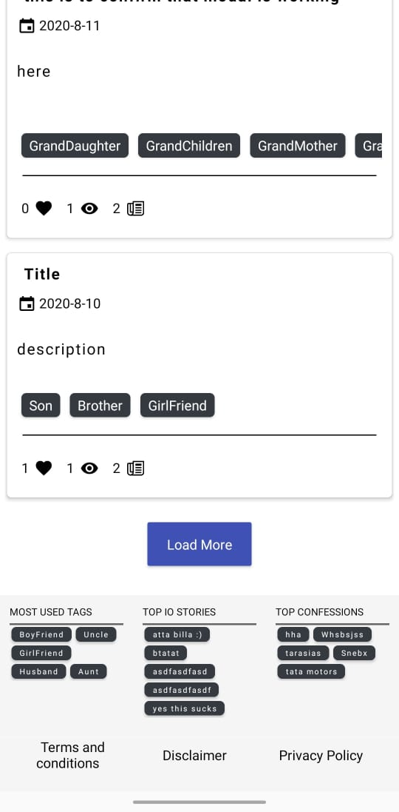&nbsp;&nbsp;&nbsp;&nbsp;&nbsp;&nbsp;&nbsp;&nbsp;&nbsp;&nbsp;&nbsp;&nbsp;&nbsp;&nbsp;&nbsp;&nbsp;&nbsp;
   &nbsp;&nbsp;&nbsp;&nbsp;&nbsp;&nbsp;&nbsp;&nbsp;&nbsp;&nbsp;&nbsp;&nbsp;&nbsp;&nbsp;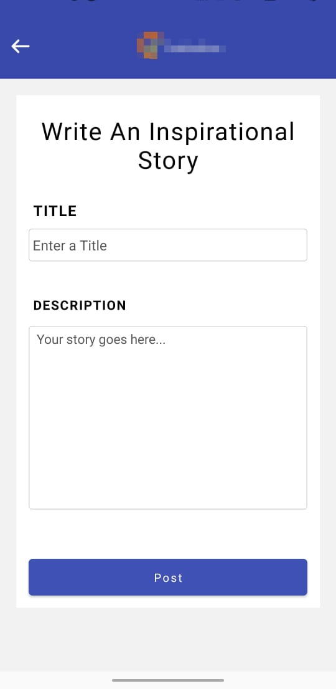
   
   9.Pagination feature &nbsp;&nbsp;&nbsp;&nbsp;&nbsp;&nbsp;&nbsp;&nbsp;&nbsp;&nbsp;&nbsp;&nbsp;&nbsp;&nbsp;&nbsp;&nbsp;&nbsp;&nbsp;
   &nbsp;&nbsp;&nbsp;&nbsp;&nbsp;&nbsp;&nbsp;&nbsp;&nbsp;&nbsp;&nbsp;&nbsp;&nbsp;&nbsp;&nbsp;&nbsp;&nbsp;&nbsp;&nbsp;&nbsp;&nbsp;&nbsp;&nbsp;&nbsp;&nbsp;&nbsp;&nbsp;&nbsp;&nbsp;&nbsp;&nbsp;&nbsp;10.Write A Story Page
   
   The user can interact to the confessions posted by the others by clicking on the tags on the Categorized Confessions Tags page as shown in the figure below. There are multiple tags categorized into Male and Female with individual personalized tags on which user can click and will be redirected to the confessions which include these tags for example by clicking on the Boyfriend tag all the confessions which used the tag Boyfriend will be listed on the redirected page where user can interact like on the homepage which includes likes comments views just like shown at the home page and ordered on the basis of popularity 
   
   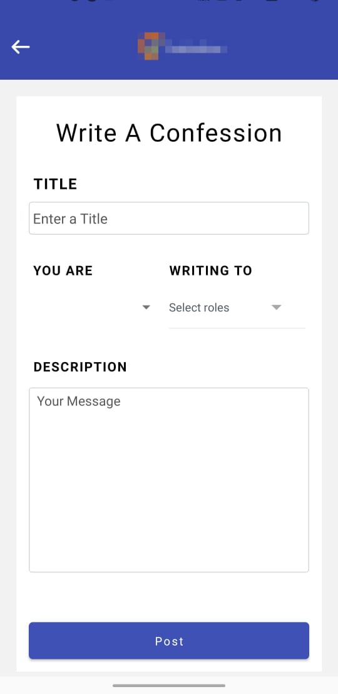 &nbsp;&nbsp;&nbsp;&nbsp;&nbsp;&nbsp;&nbsp;&nbsp;&nbsp;&nbsp;&nbsp;&nbsp;&nbsp;&nbsp;&nbsp;&nbsp;&nbsp;
   &nbsp;&nbsp;&nbsp;&nbsp;&nbsp;&nbsp;&nbsp;&nbsp;&nbsp;&nbsp;&nbsp;&nbsp;&nbsp;&nbsp;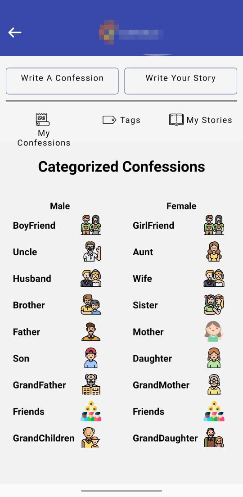
   
   11.Write A Confession Page&nbsp;&nbsp;&nbsp;&nbsp;&nbsp;&nbsp;&nbsp;&nbsp;&nbsp;&nbsp;&nbsp;&nbsp;&nbsp;&nbsp;&nbsp;&nbsp;&nbsp;&nbsp;&nbsp;&nbsp;&nbsp;&nbsp;&nbsp;&nbsp;&nbsp;&nbsp;&nbsp;&nbsp;&nbsp;&nbsp;&nbsp;&nbsp;&nbsp;&nbsp;&nbsp;&nbsp;&nbsp;&nbsp;
   &nbsp;&nbsp;&nbsp; 12.Filter Confessions Page
   
   After clicking on the confession card from the homepage user is redirected to the confession where he can perform the following on the basis of a writer and a viewer if the user has written that confession he can comment and like as well as delete and edit that confession but if the user is interacting with the page as a viewer he can only comment and like the confession as well as report the confession. 
   
   A Social media application is nothing if you don’t receive notifications in the navigation bar to ease the access for the users and have daily updates on the confessions we created a tab Notifications which notify you whenever a user like your confession comment on your confession or report your confession to differentiate the read and unread notification we have given the color to each messages read can be seen in white colors and unread as grey in color.
For each particular notification message an icon is there so that user can differentiate if it is a notification for like or a notification for the comment

   
   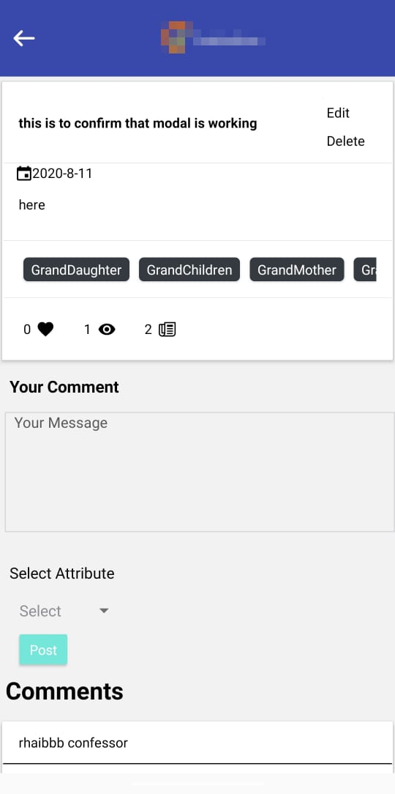 &nbsp;&nbsp;&nbsp;&nbsp;&nbsp;&nbsp;&nbsp;&nbsp;&nbsp;&nbsp;&nbsp;&nbsp;&nbsp;&nbsp;&nbsp;&nbsp;&nbsp;
   &nbsp;&nbsp;&nbsp;&nbsp;&nbsp;&nbsp;&nbsp;&nbsp;&nbsp;&nbsp;&nbsp;&nbsp;&nbsp;&nbsp;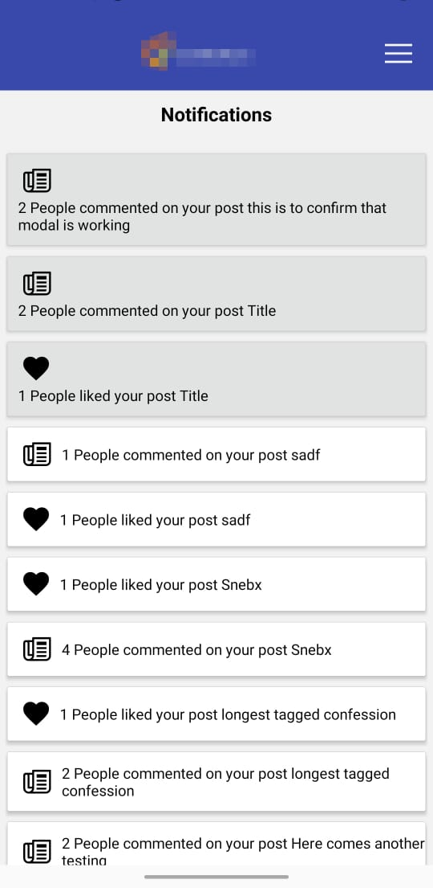
   
   
   13.Confession Display&nbsp;&nbsp;&nbsp;&nbsp;&nbsp;&nbsp;&nbsp;&nbsp;&nbsp;&nbsp;&nbsp;&nbsp;&nbsp;&nbsp;&nbsp;&nbsp;&nbsp;&nbsp;
   &nbsp;&nbsp;&nbsp;&nbsp;&nbsp;&nbsp;&nbsp;&nbsp;&nbsp;&nbsp;&nbsp;&nbsp;&nbsp;&nbsp;&nbsp;&nbsp;&nbsp;&nbsp;&nbsp;&nbsp;&nbsp;&nbsp;&nbsp;&nbsp;&nbsp;&nbsp;&nbsp;&nbsp;&nbsp;&nbsp;&nbsp;&nbsp;&nbsp;&nbsp;&nbsp;&nbsp;14.Notification Page
   
   After the user logout of the session successfully user is redirected to this page it is a simple page with two buttons one for login and other for signup as can be seen from the image down below  a three dot icon can be seen on the header of the page which shows an about option which redirect user to the About page of the website as explained above in the report.
   
   User can access the Contact Us option from the navigation bar which helps users to reach us in no time. This page includes queries that users have or issues that are faced by the users while accessing the website, they can reach out to us through this a token is raised for each particular user which is saved in the database with the user Id there are three input box one for the name other for the email which should be same as the session email address and the last one is the contact number which help us reach to the user easily. A text area is also there for the detailed explanation of the problem which is followed by the Submit button after which user is redirected to Home page and the query is saved in the database.
   
   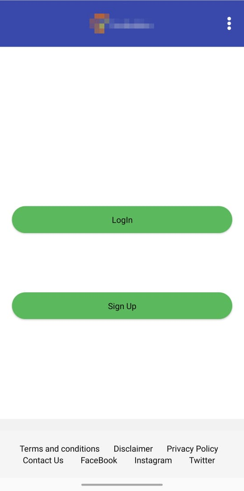 &nbsp;&nbsp;&nbsp;&nbsp;&nbsp;&nbsp;&nbsp;&nbsp;&nbsp;&nbsp;&nbsp;&nbsp;&nbsp;&nbsp;&nbsp;&nbsp;&nbsp;
   &nbsp;&nbsp;&nbsp;&nbsp;&nbsp;&nbsp;&nbsp;&nbsp;&nbsp;&nbsp;&nbsp;&nbsp;&nbsp;&nbsp; 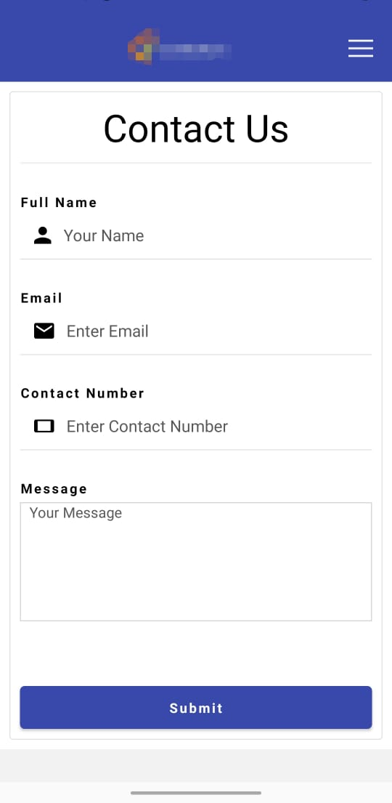
   
   15.Intro Page&nbsp;&nbsp;&nbsp;&nbsp;&nbsp;&nbsp;&nbsp;&nbsp;&nbsp;&nbsp;&nbsp;&nbsp;&nbsp;&nbsp;&nbsp;&nbsp;&nbsp;&nbsp;
   &nbsp;&nbsp;&nbsp;&nbsp;&nbsp;&nbsp;&nbsp;&nbsp;&nbsp;&nbsp;&nbsp;&nbsp;&nbsp;&nbsp;&nbsp;&nbsp;&nbsp;&nbsp;&nbsp;&nbsp;&nbsp;&nbsp;&nbsp;&nbsp;&nbsp;&nbsp;&nbsp;&nbsp;&nbsp;&nbsp;&nbsp;&nbsp;&nbsp;&nbsp;&nbsp;&nbsp;&nbsp;&nbsp;&nbsp;&nbsp;&nbsp;&nbsp;&nbsp;&nbsp;&nbsp;&nbsp;&nbsp;&nbsp;&nbsp;16.Contact-Us Page
   
   The Disclaimer, T&C and Privacy Policy screens states about company conditions and agreements which user should be acknowledged with while using the app. All consists of paragraph of texts stating company policies.
   
   About is redirected when about option is selected from the index page in navigation panel. About Screen displays a brief introduction about the app. It consists of lots of images and quotes. The first part of about page consists of a get started button which on click redirects to signup 1 screen. The second part of about consists of how the app should be used. The third part displays about what roles we can choose in the app. The last part has a quote and an image stating about stories.
   
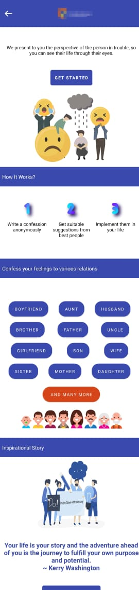 
   
   17.About-Confess-Karo Page
